# StaySphere


StaySphere is a full-stack property listing web application inspired by platforms like Airbnb.

The application allows users to explore properties, while hosts can create and manage their own listings.  
Users can book properties, leave reviews, and interact with listings through a clean and structured backend architecture.

This project was built to practice real-world backend concepts such as authentication, REST APIs, database relationships, image uploads, and location-based features.

The goal was to create something close to a production-ready app while keeping the UI simple and functional.

---

## 🌐 Live Demo

🔗 https://staysphere-4ea7.onrender.com

> Note: The app is hosted on Render, so the first request may take a few seconds to wake the server.

---

## Features

### Authentication System

- User registration and login
- Separate host functionality for property owners
- Secure session-based authentication using Passport.js

### Property Listings

- Hosts can create, edit, and delete property listings
- Each listing contains images, location, price, and description

### Booking System

- Users can book properties directly from the listing page
- Booking information stored in the database

### Reviews & Ratings

- Users can leave reviews on properties
- Rating system for better feedback

### Image Upload

- Image uploads handled using Cloudinary

### Map Integration

- Location display using Mapbox and geocoding

### Backend Architecture

- RESTful routing
- MVC architecture
- Middleware-based validation and authorization

### User Experience

- Flash messages for feedback
- Server-side rendering using EJS

---

## Tech Stack

### Backend

- Node.js
- Express.js
- MongoDB
- Mongoose
- Joi (validation)
- Passport.js (authentication)

### Frontend

- EJS templates
- Bootstrap
- JavaScript

### Services & Tools

- Cloudinary (image uploads)
- Mapbox (maps and geocoding)
- dotenv (environment variables)
- express-session
- connect-mongo
- Multer (file uploads)

This project follows the MVC (Model–View–Controller) architecture to maintain a clean separation of concerns and improve code maintainability.

---

## Project Structure

```
StaySphere
│
├── controllers
│ ├── listings.js
│ ├── reviews.js
│ └── user.js
│
├── models
│ ├── listing.js
│ ├── reviews.js
│ ├── booking.js
│ └── user.js
│
├── routes
│ ├── listings.js
│ ├── reviews.js
│ ├── booking.js
│ └── user.js
│
├── public
│ ├── css
│ ├── js
│ └── image
│
├── views
│ ├── includes
│ ├── layouts
│ ├── listings
│ └── user
│
├── utils
│ ├── ExpressError.js
│ └── WrapAsync.js
│
├── middleware.js
├── cloudConfig.js
├── schema.js
├── app.js
└── package.json
```

---

## Future Improvements

This project is continuously being improved with new features and refinements.

Upcoming plans:

- Payment integration for bookings
- Advanced search and filters
- React frontend (MERN version)
- Improved UI and performance

---

## Project Motivation

This project helped me understand how real applications handle:

- User sessions
- Secure data flow
- File uploads
- Third-party APIs
- Clean backend architecture

StaySphere represents my learning journey as a full-stack developer.

---

## Installation & Setup (Run Locally)

### 1️⃣ Clone the repository

```bash
git clone https://github.com/manas-jha19/StaySphere.git
cd StaySphere
```

### 2️⃣ Install dependencies

```bash
npm install
```

### 3️⃣ Create Environment Variables

- Create a .env file in the root directory and add:

```bash
PORT=5000
MONGO_URI=your_mongodb_connection_string
SESSION_SECRET=your_secret_key
```

- Make sure your .env file is added to .gitignore to keep credentials secure.

### 4️⃣ Start the Server

```bash
npm start
```

Now open your browser and visit:

```bash
http://localhost:5000
```

---

## Screenshots

### Project Preview

This section showcases the main features of the StaySphere platform including authentication, property listings, booking system, reviews, and location integration.

### Homepage – Browse Listings

Users can explore available property listings on the homepage.  
Listings are displayed in a card layout with images, titles, and price per night.  
Users can also filter listings using category options like Trending, Rooms, Mountains, Castles, Camping, and Farms.

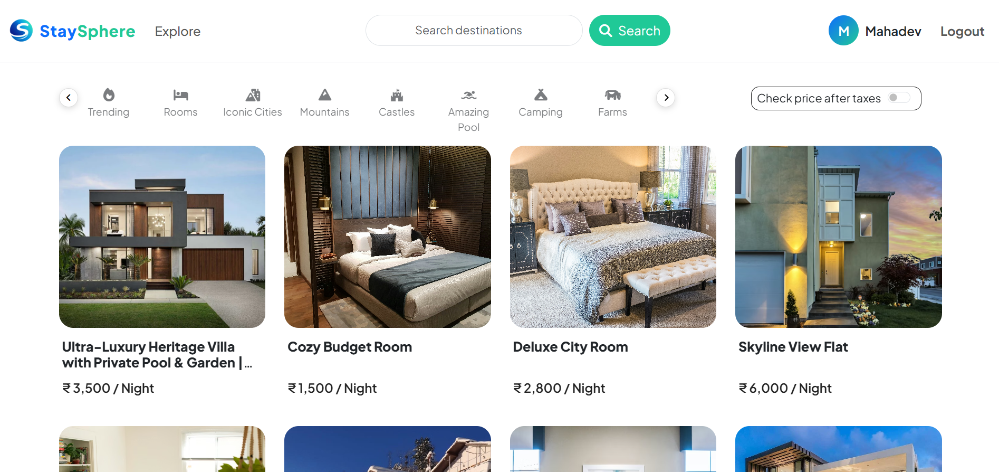

### User Signup

Users can create an account by providing username, email, password, and selecting their role.

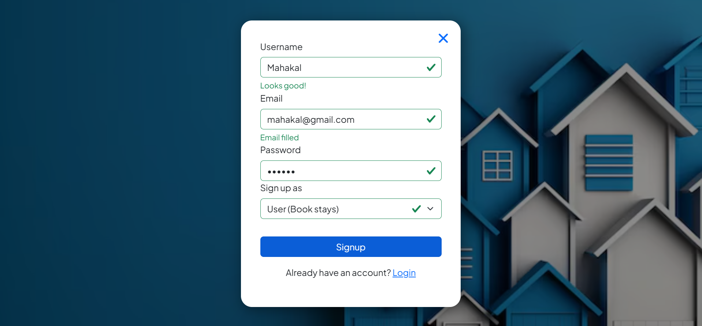

### User Login

Registered users can securely login using their username and password.

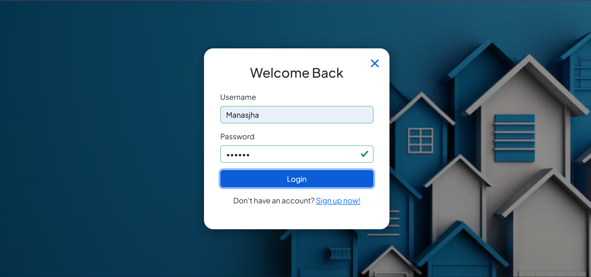

### Property Details Page

Users can view detailed information about a property including images, description, amenities, and owner details.

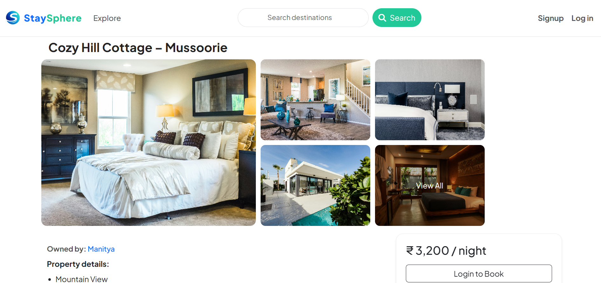

### Property Image Gallery

Users can view multiple images of the property in a gallery layout.

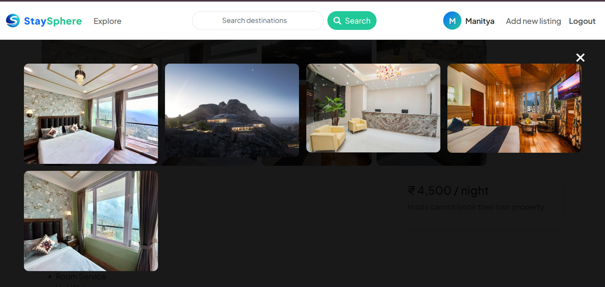

### Map Integration

Each listing includes an interactive map showing the exact location of the property.

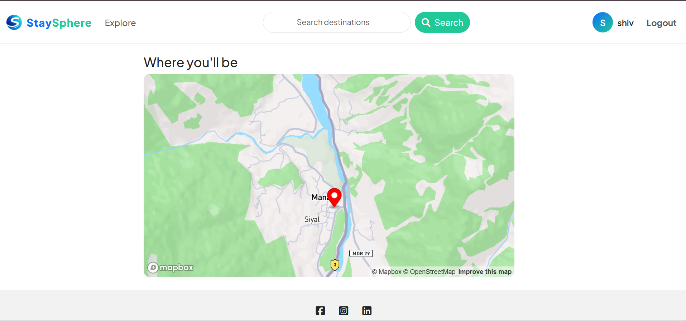

### Leave a Review

Logged-in users can leave ratings and comments for properties they have visited.

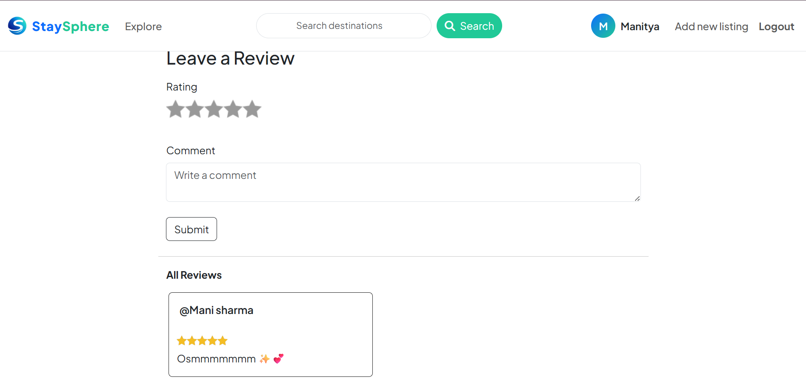

### Create New Listing

Property owners can add new listings by providing property details and images.

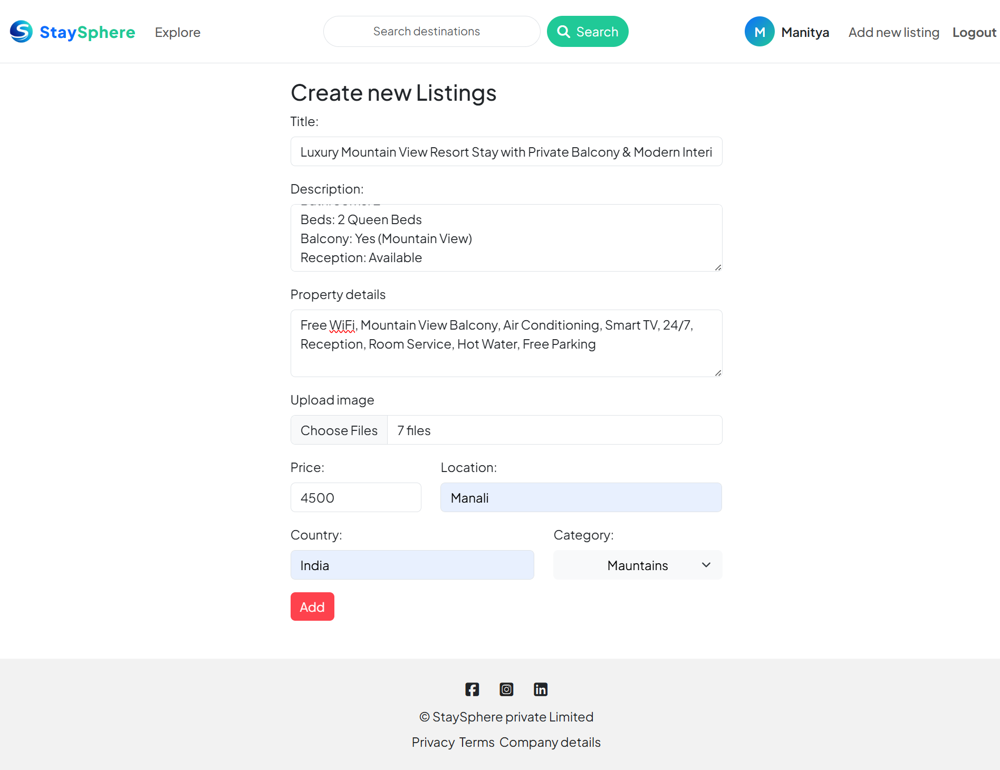

### Edit Listing

Owners can edit their existing listings.

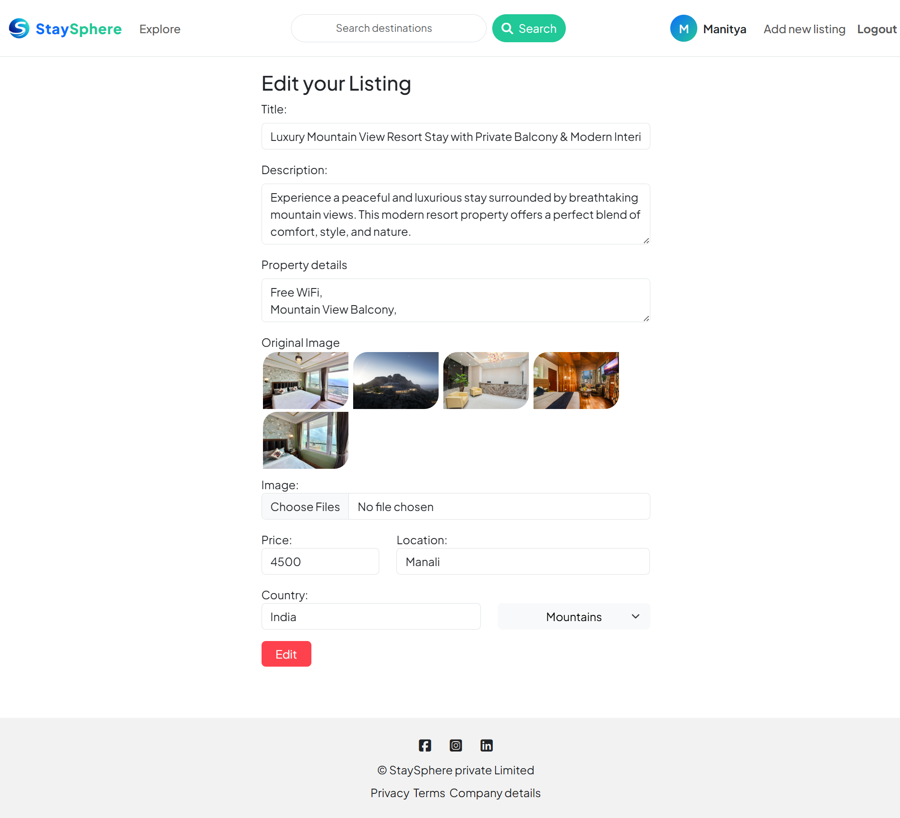

### Welcome Message

Users receive a success notification after logging in to the platform.

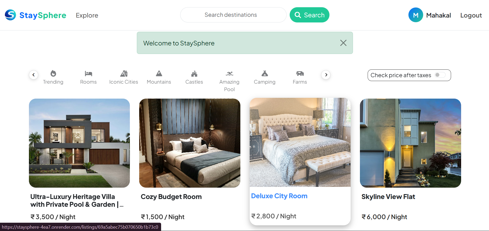

### Logout Message

Users receive confirmation alerts after logging out.

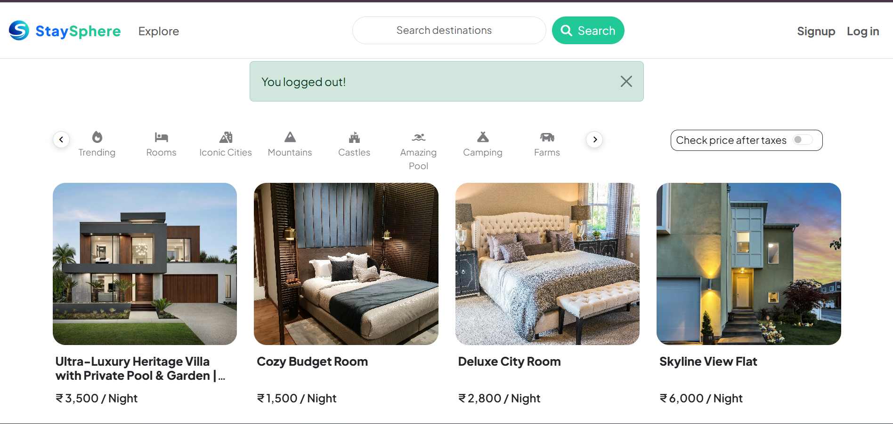

### Date Selection

Users can select check-in and check-out dates while booking a property.

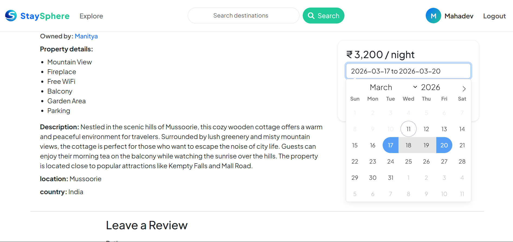

---

## What I Learned From This Project

- Structuring scalable backend applications using MVC architecture
- Implementing authentication and session management
- Working with MongoDB Atlas in a production environment
- Securing environment variables and sensitive credentials
- Designing clean and maintainable Express routing logic

---

## Author

**Manas Jha**  
Full-Stack Developer | MERN Stack Enthusiast

LinkedIn: [manas-jha-441a27253](https://www.linkedin.com/in/manas-jha-441a27253)  
GitHub: [manas-jha19](https://github.com/manas-jha19)
